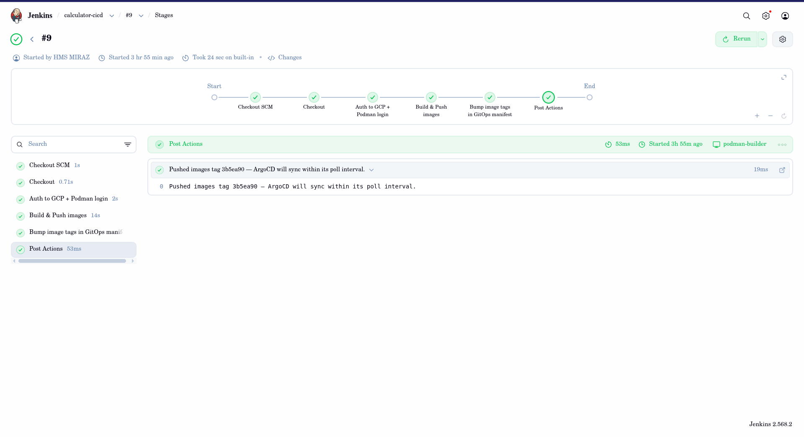
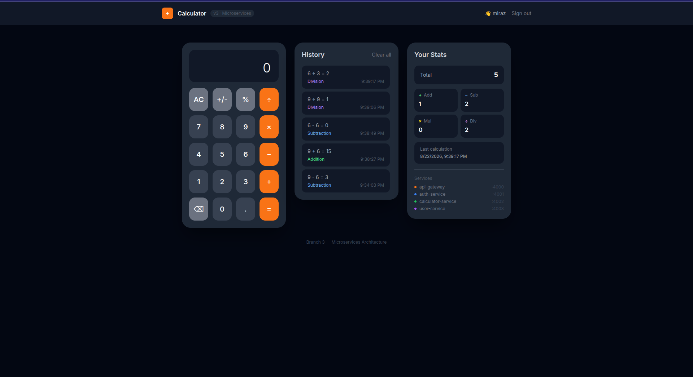
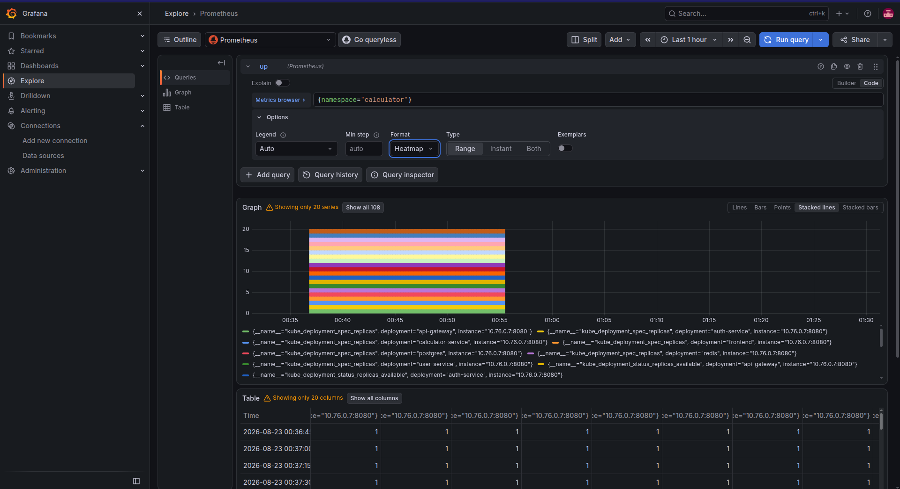
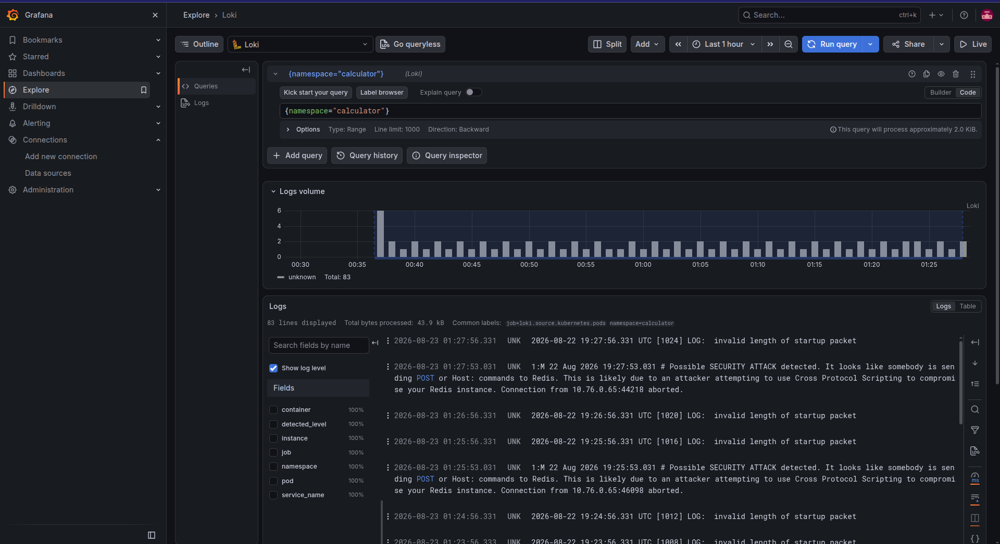

# Calculator — Full-Stack Microservices CI/CD Platform on GKE

A production-style deployment pipeline for a microservices calculator application, built end-to-end on Google Cloud: self-hosted **Jenkins** CI (building with **Podman**), **GitOps** delivery via **ArgoCD**, workloads running on **GKE**, traffic served through **nginx-ingress** behind a **Google Cloud Load Balancer**, and a self-hosted **Grafana + Loki + Prometheus** observability stack collecting logs and metrics from the entire cluster in real time.

---

## Architecture

```
GitHub (single repo: app source + IaC + CI/CD config)
      │
      ▼
Jenkins Master (GCE VM)
  │  triggers pipeline
  ▼
Jenkins Agent (GCE VM, Podman build runtime)
  │  authenticates to GCP via its own attached service account — no static keys
  ▼
podman build + push × 5 microservices  ──────►  Google Artifact Registry
  │
  ▼
Jenkins bumps image tags in a Kustomize manifest, commits back to GitHub
      │
      ▼
ArgoCD (running inside GKE, auto-sync + self-heal)
  │  watches the manifest path in the same repo
  ▼
GKE Cluster
  ├── PostgreSQL (persistent volume)
  ├── Redis
  ├── auth-service · calculator-service · user-service · api-gateway · frontend
  └── ingress-nginx  →  Google Cloud Load Balancer  →  end users

                          ▲
                          │  logs + metrics (Grafana Alloy agent)
                          │
Grafana · Loki · Prometheus (self-hosted on the Jenkins master VM)
  — real-time dashboards for logs, error rates, pod/service health across the cluster
```

**Design principles applied:**
- **CI/CD separation of concerns** — Jenkins only builds and pushes; ArgoCD is the sole actor that deploys, per GitOps best practice.
- **Keyless cloud authentication** — Jenkins' build agent uses its GCE-attached service account identity instead of downloadable JSON keys, avoiding long-lived credentials entirely.
- **Infrastructure as Code** — the entire cloud footprint (VMs, GKE cluster, firewall rules, node pools) is defined in Terraform; VM configuration is fully automated with Ansible.
- **Zero-trust network access** — Jenkins and Grafana are never exposed on the public internet; both are reached exclusively through Google's Identity-Aware Proxy (IAP) tunneling.
- **Full-stack observability** — a self-hosted Grafana/Loki/Prometheus stack ingests logs and metrics from every pod in the cluster via a lightweight Grafana Alloy agent, with custom dashboards for live logs, error detection, and pod/service health.

---

## Tech Stack

| Layer | Technology |
|---|---|
| Cloud Platform | Google Cloud Platform (GCE, GKE, Artifact Registry, Secret Manager, IAP) |
| Infrastructure as Code | Terraform, Ansible |
| CI | Jenkins (SSH-distributed build agent), Podman |
| CD | ArgoCD (GitOps) |
| Container Orchestration | Kubernetes (GKE), Kustomize |
| Ingress / Networking | nginx-ingress, Google Cloud Load Balancer |
| Observability | Grafana, Loki, Prometheus, Grafana Alloy |
| Application | Node.js/Express (5 microservices), Next.js frontend, PostgreSQL, Redis |
| Version Control | Git, GitHub |

---

## Screenshots

**Jenkins CI Pipeline** — automated build and push of all 5 service images


**ArgoCD GitOps Dashboard** — live sync status and dependency graph of the running application


**Application UI** — the deployed calculator app, served through the full pipeline


**Grafana Dashboard** — custom-built observability dashboard covering logs and pod/service health


**Prometheus Metrics** — real-time metrics collection across the cluster


**Loki Log Aggregation** — centralized, label-indexed logs from every pod in the cluster


---

## Repository Structure

```
.
├── api-gateway/            Node/Express — routing, JWT auth, rate limiting
├── auth-service/           Node/Express — authentication
├── calculator-service/     Node/Express — core business logic
├── user-service/           Node/Express — user data
├── frontend/               Next.js (standalone build)
│
├── terraform/              GKE cluster, GCE VMs, firewall rules, IAM
├── ansible/                Jenkins master + build agent configuration
├── k8s/gitops/             Kubernetes manifests — the GitOps source of truth for ArgoCD
├── k8s/observability/      Grafana Alloy agent configuration
│
└── Jenkinsfile             CI pipeline: checkout → build → push → bump manifest
```

---

## Key Highlights

- Designed and implemented a complete **self-hosted CI/CD platform** from infrastructure provisioning through production deployment, without relying on managed CI/CD SaaS products.
- Built a **secure, keyless authentication model** between CI infrastructure and Google Cloud, eliminating static service account keys.
- Implemented **GitOps continuous delivery** with automatic drift correction (ArgoCD self-heal).
- Deployed a **5-service microservices architecture** on Kubernetes with proper service discovery, persistent storage, and ingress routing.
- Stood up a **production-grade observability stack** (Grafana/Loki/Prometheus) from scratch, with log aggregation and dashboarding across an entire Kubernetes cluster.
- Applied **zero-trust access patterns** — no administrative interface (Jenkins, Grafana) is ever exposed to the public internet.

---

## Live Environment

- **Application**: `http://<LOAD_BALANCER_IP>/`
- **CI/CD, ArgoCD, and observability dashboards**: accessible via GCP IAP tunneling (admin-only, not publicly exposed by design)